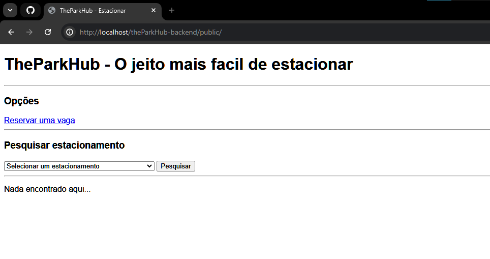
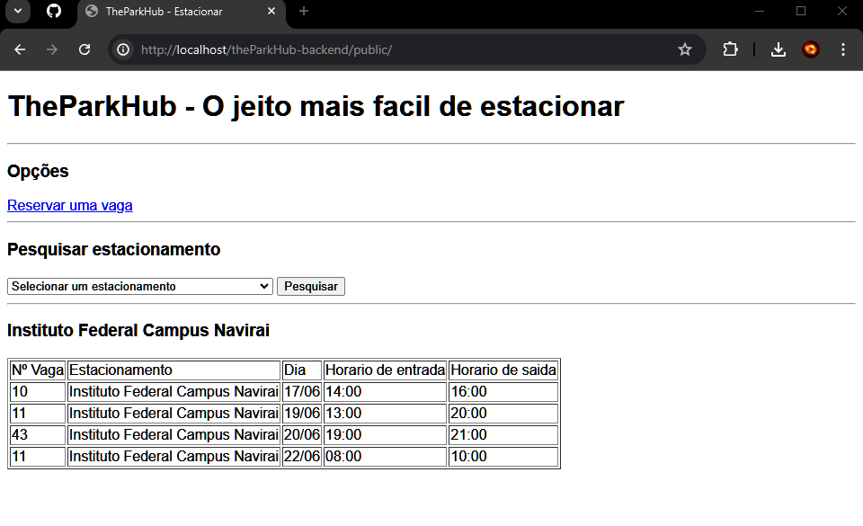
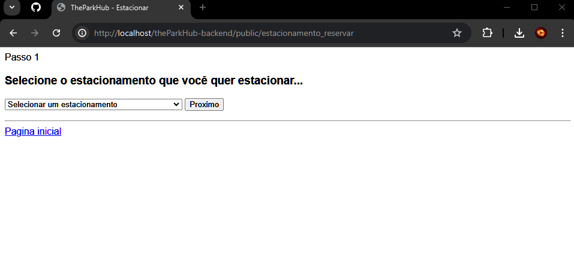
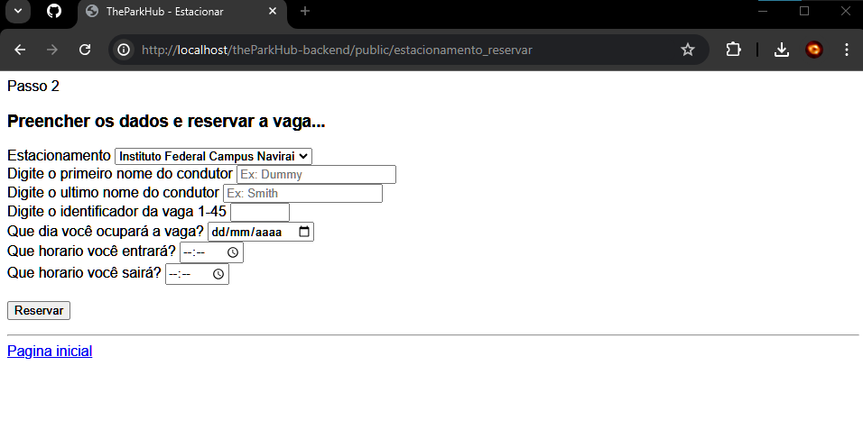
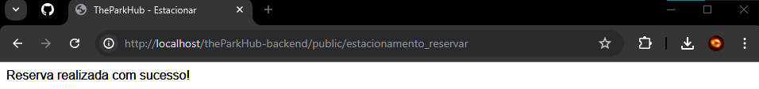

# Como Usar?

* Crie um Banco de dados que respeite os models e seus fillables, após isso configure o ```.env``` do projeto para linkar o Laravel ao seu Banco de dados.

* Faça algumas querys de inserção de exemplo para testar o software na pratica


# Importante!

* O Software NÃO possui interface, e NÃO está seguindo as melhores práticas do mundo, o objetivo é ser um MVP Básico de back-end para entender como uma gestão de vagas funciona brevemente, não está com a tabela Usuarios.

# Tabelas do SQL Para funcionar

```SQL
CREATE TABLE Estacionamentos IF NOT EXISTS (
    IDEstacionamento INT PRIMARY KEY AUTO_INCREMENT,
    TargetName Varchar(99) NOT NULL,
    QntVagas INT NOT NULL,
    VagasReservadas INT DEFAULT 0
);

CREATE TABLE Vagas IF NOT EXISTS (
    IDVagaGeneral INT AUTO_INCREMENT PRIMARY KEY,
    IDVagaSingle INT,
    IDEstacionamento INT,
    FirstName VARCHAR(24),
    LastName VARCHAR(24),
    HorarioEntrada TIMESTAMP DEFAULT CURRENT_TIMESTAMP,
    HorarioSaida TIMESTAMP DEFAULT CURRENT_TIMESTAMP,
    DataLog DATE DEFAULT CURRENT_DATE,
    FOREIGN KEY (IDEstacionamento) REFERENCES Estacionamento(IDEstacionamento)
);
```

# Testes:

* A Primeira tela que você verá após abrir o software é essa, contendo algumas opções



* E Essa é se você opta por buscar por algum estacionamento dentre os registrados no banco de dados



* Essa é a tela para reservar, após entrar você verá o passo 1 da reserva



* Após escolher o estacionamento, você verá o real formulario, que no projeto real não terá varias informações que tem, já que no real, dados como nome e estacionamento desejado já vão estar linkados no usuario da pessoa, mas no momento, esse será o formulario:



* Após preencher corretamente, respeitando as validações, esse será o retorno do software:


